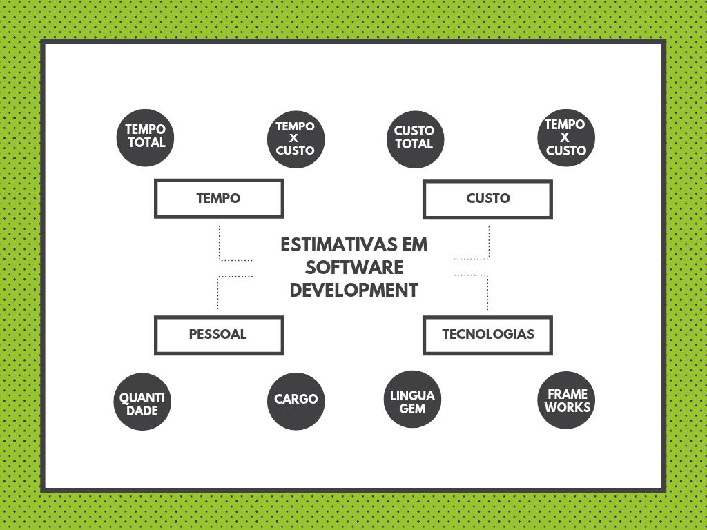
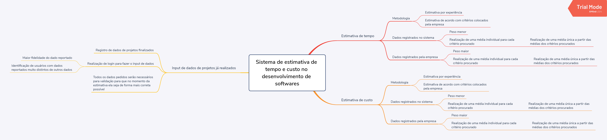
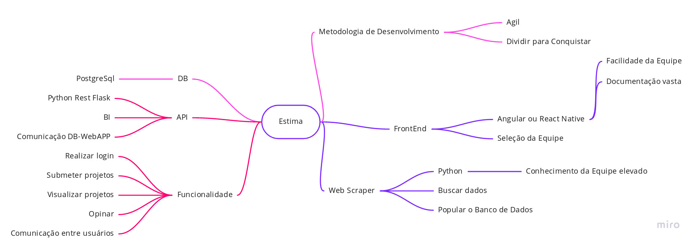

# Mapa Mental

#### Histórico de revisões
|   Data   |  Versão  |        Descrição       |          Autor(es)          |
|:--------:|:--------:|:----------------------:|:---------------------------:|
|22/08/2019|   0.1    | Iniciando o documento       |  Victor Rodrigues   |
|23/08/2019|   0.2    | Adicionando Mapa Mental 1.0    |  Lucas Gomes |
|23/08/2019|   0.3    | Adicionando item 2.4 e 2.5   |  Rafael Bragança |

## 1. Introdução

Mapa mental é um diagrama que permite que você organize ideias de forma simples e lógica, representando-as visualmente, facilitando o processo de memorização. Ele começa com um tema central, que evolui através de linhas ou “ramos” relacionando os subtópicos do tema.

## 2. Mapas Mentais

### 2.1 Mapa Mental: Conteúdo da aplicação.

Mapa mental que contempla o conteúdo foco da aplicação, que seria a coleta e compartilhamento de dados referentes a desenvolvimento de software, como os custos, tempo, gestão de pessoal e tecnologias utilizadas no desenvolvimento desde projetos inteiros até uma simples feature.

**Versão 1.0**

 

### 2.2 Mapa Mental

**Versão 1.0**

 

### 2.3 Mapa Mental

**Versão 1.0**

### 2.4 Mapa Mental

**Versão 1.0**

### 2.5 Mapa Mental

**Versão 1.0**

## Referências

[1] AMORIM, Rebeca. Como fazer um mapa mental. Disponível em https://geekiegames.geekie.com.br/blog/como-fazer-um-mapa-mental/
