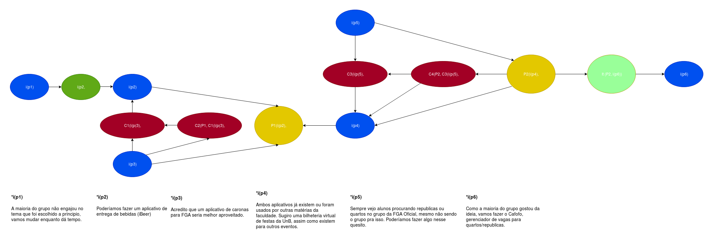

# Argumentação

#### Histórico de revisões
|   Data   |  Versão  |        Descrição       |          Autor(es)          |
|:--------:|:--------:|:----------------------:|:---------------------------:|
|26/08/2019|1.0| Iniciando o documento e adicionando AR1 |André Lucas|

## 1. Introdução

A argumentação se define por uma troca de palavras em forma de argumentos em meio a uma discussão na busca de se chegar a uma conclusão sobre algo. A partir disso, foram montadas técnicas de pré-rastreabilidade que constroem artefatos formais cujo objetivo é mostrar o progresso de decisão entre diferentes opiniões a respeito do produto ou do projeto. Nesse caso, está sendo usado o framework ACE para montar os diagramas de argumentação, que é focado em verificar a validação relativa dos artefatos discutidos.

## 2. AR1 - Mudança do tema

Diagrama de argumentação baseado na discussão para mudança do tema que seria abordado pela equipe na disciplina. Na qual ficou decidido que o aplicação sobre o qual fariamos os trabalhos seria o Cafofo.

**Versão 1.0**

Autor: André Lucas
