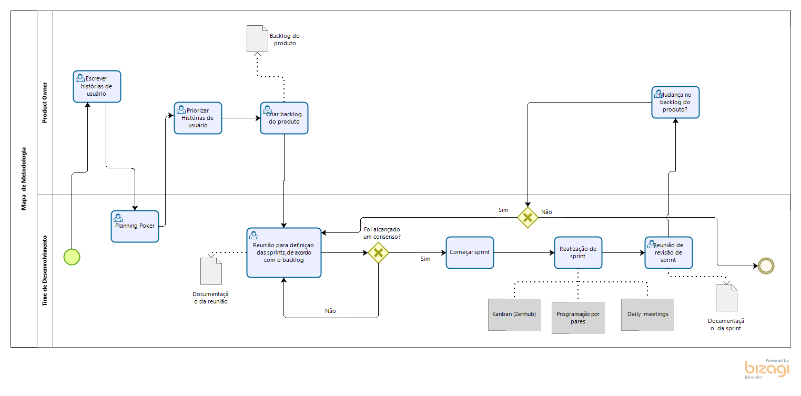

# Modelagem do Processo

### Histórico de versões

|   Data   |  Versão  |        Descrição       |          Autor(es)          |
|:--------:|:--------:|:----------------------:|:---------------------------:|
|04/09/2019|0.1|Modelagem do processo geral|[Cauê](https://github.com/caue96) e [Rafael](https://github.com/rafaelbrg)|
|04/09/2019|0.2|Adicionando Introdução|[Caio César Beleza](https://github.com/Caiocbeleza)|
|04/09/2019|0.3|Adicionando Modelagem do processo de Desenvolvimento|[Caio César Beleza](https://github.com/Caiocbeleza)|

## 1. Introdução
A modelagem do processo metodológico a ser utilizada neste projeto foi feita à partir do BPMN(Business Process Model and Notation), que é uma notação para modelagem de processos de negócios e é apresentada como um mapeamento, com ícones padrão, com o objetivo de fornecer uma imagem intuitiva para os membros da equipe.

A notação foi adaptada ao escopo, à metodologia e à equipe de desenvolvimento do projeto para melhor entendimento e sincronia entre os membros.   

### Modelagem Processo Geral

### Modelagem Processo Metodologia

### Modelagem Processo Desenvolvimento

