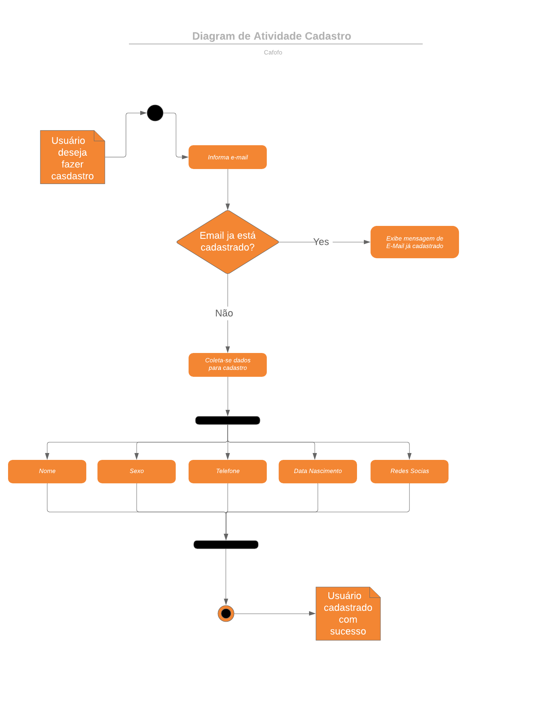

# Diagrama de Atividade

#### Histórico de revisões
|    Data    | Versão |       Descrição       |    Autor(es)     |
| :--------: | :----: | :-------------------: | :--------------: |
| 16/09/2019 |  0.1   | Iniciando o documento | João Gabriel |
| 16/09/2019 |  0.1   | inserindo Diagrama de Atvidade Login | João Gabriel |
| 16/09/2019 |  0.1   | inserindo Diagrama de Atvidade Cadastro | João Gabriel |

## 1. Introdução

O diagrama de atividades é um diagrama de comportamento UML que mostra o fluxo de controle ou o fluxo de objetos com ênfase na sequência e nas condições do fluxo. 

Diagrama de Atividade é um subdiagrama derivado do UML(Unified Modeling Language), onde é modelado o que deve acontecer dentro do sistema a ser desenvolvido. Ajudando assim os Stakeholders a entender de forma mais clara o sistema. Possuindo símbolos específicos indicando, por exemplo, onde começa e onde temina as atividades.

# 2. Diagramas de Atividade

#### Cadastro

#### Login

# 3.Referências

[UML- Diagrama de Atividade](https://www.uml-diagrams.org/activity-diagrams.html)