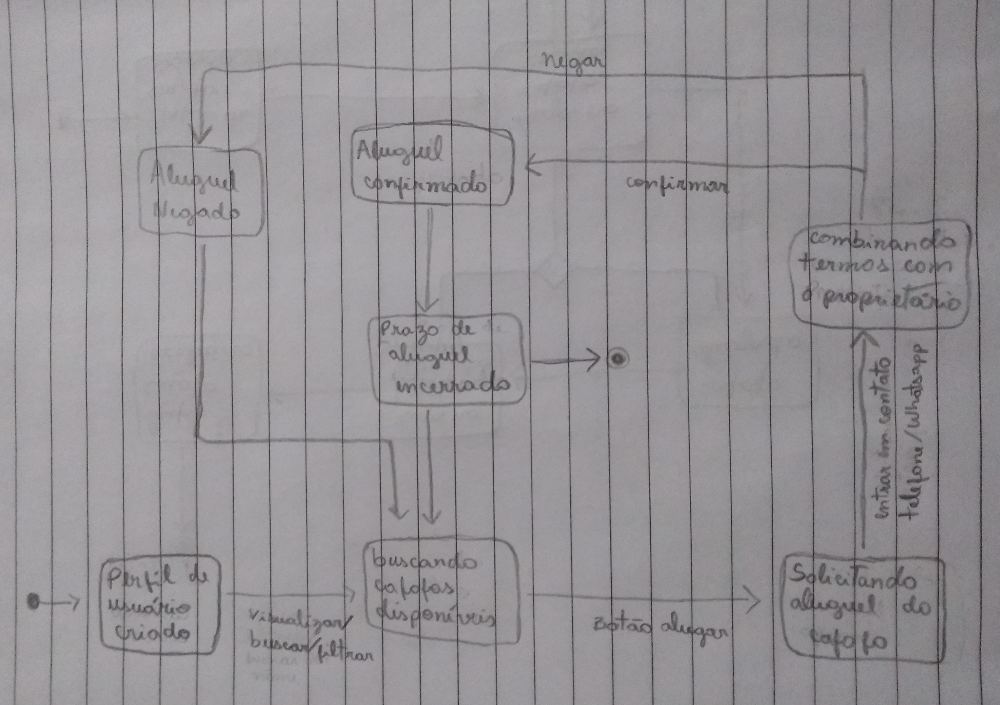

# Modelos UML Dinâmicos

#### Histórico de revisões
|    Data    | Versão |       Descrição       |    Autor(es)     |
| :--------: | :----: | :-------------------: | :--------------: |
| 15/09/2019 |  0.1   | Iniciando o documento | André Lucas |
| 16/09/2019 |  0.2   | Adicionando diagrama de colaboração | André Lucas |
| 16/09/2019 |  0.3   | Adicionando diagramas de estado 4.1-V1 e 4.2-V1 | Weiller Fernandes |

## 1. Introdução

Demonstram as características comportamentais de um sistema, demonstra como o sistema se comporta. Modelos dinâmicos identificam os objetos necessários para construir o sistema e como eles se comunicam, através de seus métodos e mensagens.

## 2. Diagrama de Sequência

## 3. Diagrama de Colaboração

Um diagrama dinâmico que mostra a interação entre objetos e/ou partes usando mensagens sequenciais. Ênfase na ordem das mensagens, normalmente, com foco em um cenário de uso.

**Versão 1.0**

## 4. Diagrama de Estados

Um diagrama dinâmico que procura apresentar os vários estados pelos quais um objeto pode passar dentro da aplicação e as transações responsáveis pelas suas mudanças de estado.

### 4.1. Cafofo

**Versão 1.0**

### 4.2. Hóspede

**Versão 1.0**

## 5. Diagrama de Atividades

## 6. Referências

- [Diagrama de Colaboração](https://www.uml-diagrams.org/communication-diagrams.html)

- [Diagrama de Estado](http://www.dsc.ufcg.edu.br/~jacques/cursos/map/html/uml/diagramas/estado/diag_estados.htm)
