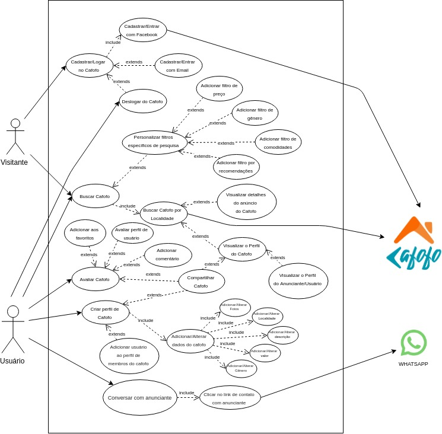

# Modelos UML Dinâmicos

#### Histórico de revisões
|    Data    | Versão |       Descrição       |    Autor(es)     |
| :--------: | :----: | :-------------------: | :--------------: |
| 15/09/2019 |  0.1   | Iniciando o documento | André Lucas |
| 16/09/2019 |  0.2   | Adicionando Diagrama de colaboração | André Lucas |
| 16/09/2019 |  0.3   | Iniciando o documento | João Gabriel |
| 16/09/2019 |  0.3   | inserindo Diagrama de Atividade Login | João Gabriel |
| 16/09/2019 |  0.3   | inserindo Diagrama de Atividade Cadastro | João Gabriel |
| 16/09/2019 |  0.4   | Adicionando Diagramas de estado 3.1-V1 e 3.2-V1 | Weiller Fernandes |
| 18/09/2019 |  0.5   | Adicionando Diagrama de Caso de Uso V1 | Lucas Gomes |
| 24/09/2019 | 0.6    | Adicionando Diagrama de estado 3.1-V2 | Weiller Fernandes |
| 25/09/2019 | 0.7    | Adicionando Diagrama de Casos de Uso V2 | Weiller Fernandes |
| 25/09/2019 | 0.7    | Adicionando Diagrama de colaboração v2 | André Lucas |

## 1. Introdução

Demonstram as características comportamentais de um sistema, demonstra como o sistema se comporta. Modelos dinâmicos identificam os objetos necessários para construir o sistema e como eles se comunicam, através de seus métodos e mensagens.

## 2. Diagrama de Colaboração

Um diagrama dinâmico que mostra a interação entre objetos e/ou partes usando mensagens sequenciais. Ênfase na ordem das mensagens, normalmente, com foco em um cenário de uso.

**Versão 1.0**

**Versão 2.0**

## 3. Diagrama de Estados

Um diagrama dinâmico que procura apresentar os vários estados pelos quais um objeto pode passar dentro da aplicação e as transações responsáveis pelas suas mudanças de estado.

### 3.1. Anúncio de Cafofo

**Versão 1.0**

Autor: Weiller Fernandes

**Versão 2.0**

Conforme estabelecido e acordado na reunião do dia 23/09/2019, o app Cafofo não apresentará mais um perfil exclusivo para cada Cafofo, mas sim anúncios diretos dos mesmos. Essa versão 2.0 procura atualizar o diagrama de estados para essa situação.

Autor: Weiller Fernandes

### 3.2. Hóspede

**Versão 1.0**

Autor: Weiller Fernandes

## 4. Diagrama de Atividades
O diagrama de atividades é um diagrama de comportamento UML que mostra o fluxo de controle ou o fluxo de objetos com ênfase na sequência e nas condições do fluxo.

#### Pesquisa/Login/Cadatro

#### Login

## 5. Diagrama de Casos de Uso
O diagrama de caso de uso descreve a funcionalidade proposta para um novo sistema que será projetado, é uma excelente ferramenta para o levantamento dos requisitos funcionais do sistema.

**Versão 1.0**

**Versão 2.0**

## 6. Referências

- [Diagrama de Colaboração](https://www.uml-diagrams.org/communication-diagrams.html)

- [UML- Diagrama de Atividade](https://www.uml-diagrams.org/activity-diagrams.html)

- [Diagrama de Estado](http://www.dsc.ufcg.edu.br/~jacques/cursos/map/html/uml/diagramas/estado/diag_estados.htm)
