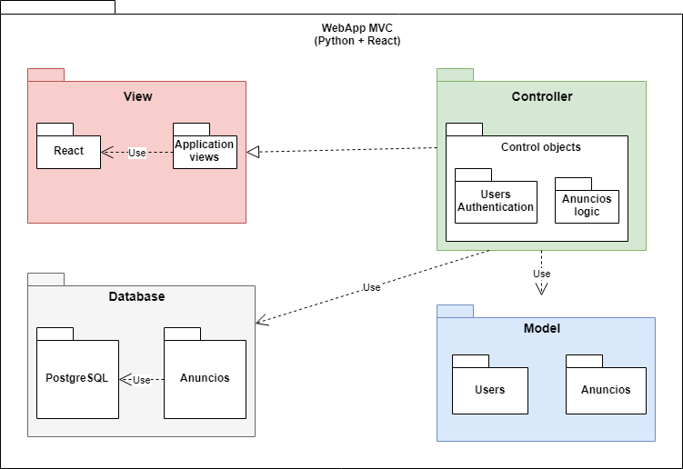
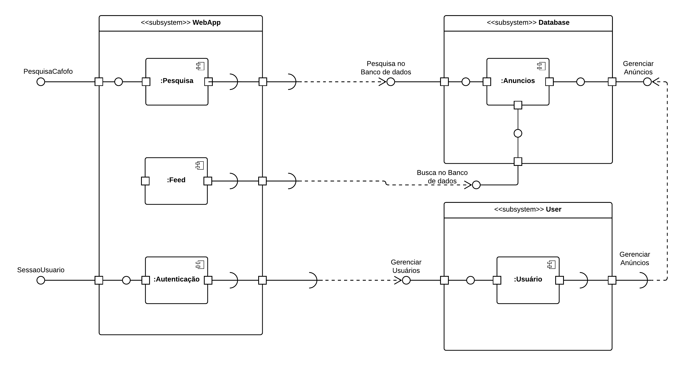

# Modelos UML Estáticos

#### Histórico de revisões
|    Data    | Versão |       Descrição       |    Autor(es)     |
| :--------: | :----: | :-------------------: | :--------------: |
| 15/09/2019 |  0.1   | Iniciando o documento | André Lucas |
| 16/09/2019 |  0.2   | Adicionando Diagrama de componetes 1.0 | [Victor Rodrigues](https://github.com/VictorRodriguesS0) |
|18/09/2019|0.3|Adicionando diagrama de pacotes Versão 1.0|[Caio César Beleza](https://github.com/Caiocbeleza)|

## 1. Introdução

O diagrama de pacotes mostra o arranjo e a organização dos elementos do modelo em projetos de médio a grande porte que podem ser usados para mostrar a estrutura e as dependências entre subsistemas ou módulos, como por exemplo: classes, interfaces e até mesmo outros pacotes de acordo com a semântica. Eles são bastante utilizados para representar a arquitetura do projeto.
Já o diagrama de componentes mostra o arranjo e organização de elementos da aplicação separados em subsistemas e funcionalidades da aplicação com relação a interface das funcionalidades.

## 2. Diagrama de Classes

## 3. Diagrama de Pacotes

**Versão 1.0**

Autor: Caio César Beleza

## 4. Diagrama de Componentes

**Versão 1.0**

Autor: Victor Rodrigues Silva

## 5. Referências

> Arquitetura e Desenho do Software - 2019.1 - Unigrade - https://ads-unigrade-2019-1.github.io/Wiki/dinamica03/app/)

> UML - https://www.uml.org/

> UML - Conceitos Básicos - http://www.macoratti.net/vb_uml2.htm
