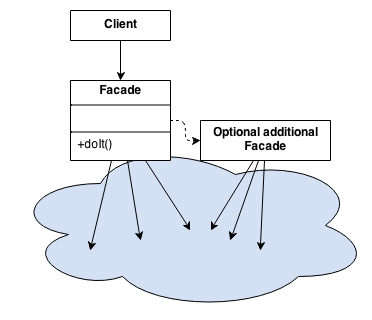

# GOFs

#### Histórico de revisões
|    Data    | Versão |                  Descrição                  |           Autor(es)            |
| :--------: | :----: | :-----------------------------------------: | :----------------------------: |
| 15/10/2019 |  0.1   | Iniciando o documento e adicionando padrões |          André Lucas           |
| 18/10/2019 |  0.2   |         Adicionando padrão Factory          | André Lucas e Victor Rodrigues |
| 24/10/2019 |  0.3   |         Adicionando informações no padrão factory          | Victor Rodrigues e André Lucas |
| 24/10/2019 |  0.4   |         Adicionando Padrão Observer          | Caio César Beleza |
| 24/10/2019 |  0.5   | Adicionando Facade e Template Method | João Saliba |
| 03/11/2019 |  0.6   | Adicionando Facade React | Lucas Gomes |

## 1. GOFs Criacionais

### 1.1 Factory

É um padrão criacional que define uma interface ou classe abstrata para a criação de um objeto, mas deixe as subclasses decidirem qual classe instanciar. Em outras palavras, as subclasses são responsáveis ​​por criar a instância da classe.

### Factory no Cafofo

Implementamos o Factory Method para criar uma fábrica de botões. A estrutura do botão permanece a mesma, diferenciando apenas as cores, texto e ações de cada um.

Vamos criar um botão de forma abstrata, porque o mesmo será sobrescrito no final:

```javascript
const button = ({ onClick, icon, type, text, backColor }) => (
    <button style={content, { backgroundColor: backColor }} type={type} onClick={onClick}>
        {icon ?  : null}
        <text style={textStyle}>{text}</text>
    </button>
)

var Button = React.createFactory((button));

export default button;
```

Depois iremos criar a nossa fábrica de botões, instanciando cada tipo de botão:
```javascript
class ButtonFactory {
    static factoryMethod(data, props) {
        switch (data) {
            case 'facebook':
                return <Button
                    icon={fb}
                    text={"Entrar com Facebook"}
                    backColor={'#3b5998'}
                    type={"submit"}
                />
            case 'email':
                return <Button
                    icon={email}
                    text={"Entrar"}
                    backColor={'#fa6900'}
                    type={"submit"}
                />
            case 'google':
                return <Button
                    icon={google}
                    text={"Entrar com Google"}
                    backColor={'red'}
                    type={"submit"}

                />
        }
    }
}

export default (ButtonFactory);
```

Agora cada botão possui cores, ações e textos diferentes. Por fim o componente ficará estruturado assim:

```javascript
import ButtonFactory from '../../factory/button/index';

render() {
    return (
        <Container>
            <Form onSubmit={this.handleSubmit}>
                <h1>Acesse a sua conta</h1>
                <input
                    type="email"
                    placeholder="Endereço de e-mail"
                    onChange={e => this.setState({ email: e.target.value})}
                />
                <input
                    type="password"
                    placeholder="Senha"
                    onChange={e => this.setState({ password:e.target.value })}
                />
                <Link to="/esqueci-a-senha">Esqueceu sua senha?</Link>

                //Botão de login com email
                {ButtonFactory.factoryMethod('email')}

                //Botão de login com facebook
                {ButtonFactory.factoryMethod('facebook')}

                //Botão de login com google
                {ButtonFactory.factoryMethod('google')}

                <hr />
                <Link to="/cadastro">Cadastre-se</Link>
            </Form>
        </Container>
    );
}
```

Este é o diagrama que representa a fábrica de botões:


#### Implementação
Demonstração de como ficaram os elementos após a implementação do padrão Factory.


## 1.2 Composite
Composite um padrão de projeto de software utilizado para representar um objeto formado pela composição de objetos similares. Este conjunto de objetos pressupõe uma mesma hierarquia de classes a que ele pertence. Tal padrão é, normalmente, utilizado para representar listas recorrentes - ou recursivas - de elementos. Além disso, este modo de representação hierárquica de classes permite que os elementos contidos em um objeto composto sejam tratados como se fossem um objeto único. Desta forma, os métodos comuns às classes podem ser aplicados, também, ao conjunto agrupado no objeto composto.

### Composite no Cafofo

Implementamos o composite na estrutura de Vacancy. Vacancy é referente a um cômodo que pertence a um cartão criado pelo usuário. Leaf é uma classe herdeira de Vacancy e é o objeto que é criado quando chamado. Composite é um conjunto de Leafs e pode ser tratado com um objeto.

A seguir, segue o código implementado na aplicação.

#### Vacancy Model

```
from django.db import models
from cards.models import Card
from person.models import Person

class Vacancy(models.Model):
    pictures = []
    state = models.BooleanField(default=True)
    card = models.ForeignKey(
        Card,
        related_name = 'vacancies',
        on_delete = models.CASCADE,
        verbose_name = 'card',
        blank=True, null=True
    )

    # class Meta:
    #     abstract = True

    def get_price(self):
        if hasattr(self, 'composite'):
            return self.composite.get_price()
        if hasattr(self, 'leaf'):
            return self.leaf.get_price()

    def get_area(self):
        if hasattr(self, 'composite'):
            return self.composite.get_area()
        if hasattr(self, 'leaf'):
            return self.leaf.get_area()

    def updateState(self):
        self.state = not self.state
```

#### Composite Model
```
class Composite(Vacancy):

    def get_price(self):
        price = 0
        for vacancy in self.vacancies.all():
            price+= vacancy.get_price()
        return price

    def get_area(self):
        area = 0
        for vacancy in self.vacancies.all():
            area+= vacancy.get_area()
        return area
```


## 2. GOFs Comportamentais
### 2.1 Observer

O padrão observer permite definir um mecanismo de aviso, que notifica múltiplos objetos sobre eventos que ocorrem com os objetos que eles estão observando.
Este padrão é utilizado quando o acoplamento das classes está crescendo, ou quando se tem ações a serem executadas apoós um determinado processo.

```
from rest_framework.permissions import IsAuthenticated ,AllowAny ,IsAdminUser
from rest_framework.response import Response
from rest_framework.views import APIView
from rest_framework.decorators import permission_classes
from rest_framework import viewsets, generics
from users.models import CustomUser
from users.serializers import UserSerializer,UserCreateUpdateSerializer


@permission_classes([IsAuthenticated])
class ExampleView(APIView):
    #permission_classes = [IsAuthenticated]

    def get(self, request, format=None):
        content = {
            'status': 'request was permitted'
        }
        return Response(content)


class UserUpdateDeleteSet(generics.RetrieveUpdateDestroyAPIView):
    queryset = CustomUser.objects.all()
    serializer_class = UserSerializer
    permission_classes = (AllowAny,)


class ListUser(generics.ListAPIView):
    #permission_classes = [IsAdminUser]
    queryset = CustomUser.objects.all()
    serializer_class = UserSerializer

class CreateUser(generics.CreateAPIView):
    permission_classes = [AllowAny]
    queryset = CustomUser.objects.all()
    serializer_class = UserCreateUpdateSerializer
```

Neste exemplo é mostrado "@permission_classes" que funciona para autenticar quem pode acessar as páginas, que no caso, seriam apenas usuários que possuem cadastro na aplicação.</p>
O observer pode ser utilizado neste caso por que a aplicação espera a notificação de que o usuário está logado, para "avisar" aos outros objetos que agora poderão ser acessados por este usuário.

### 2.2 Facade

Como o nome sugere Facade, é realmente uma fachada,podemos fazer a seguinte analogia, quando caminhamos em frente a um prédio com uma bela fachada, vemos as belas janelas as paredes bem decoradas, ou seja um ambiente bem amigável, e ignoramos toda a complexidade por trás da obra, a quantidade de salas, todas as empresas que estão neste prédio, deste modo o Facade também age nos projetos de software, dentre seus benefícios, alguns são:

- Reduz a complexidade de uma api, liberando acesso a métodos de alto nível encapsulando os demais.
- Produz uma interface comum e simplificada.
- Pode encapsular uma ou mais interfaces mal projetadas em uma mais concisa.
- Reduz drasticamente o acoplamento entre as camadas do projeto.

Resumindo: Serve para prover uma interface simplificada para a utilização de várias interfaces de um subsistema.


#### 2.2.1 Estrutura Genérica



#### 2.2.2 Utilização no projeto Cafofo

O Facade foi utilizado tanto no back end (Django) como no front end (React).

Seguindo boas práticas de implementação do Django, é possível identificar tal padrão de projeto dentro do arquivo urls.py. Onde na aplicação existem vários apps, e cada um possui seu arquivo url, sendo o ulrs.py do projeto uma fachada para chamar as outras urls.py de cada app.

No React, segue o mesmo padrão da tecnologia, sendo possível identificar tal padrão de projeto dentro do arquivo App.js, onde na aplicação existem vários *Components*, sendo todos colocados juntos neste arquivo App.js que serve como uma fachada para chamar esses outros *Components* da aplicação.
##### Implementação Django
```
# cafofo_api urls.py

"""cafofo_api URL Configuration

The `urlpatterns` list routes URLs to views. For more information please see:
    https://docs.djangoproject.com/en/2.2/topics/http/urls/
Examples:
Function views
    1. Add an import:  from my_app import views
    2. Add a URL to urlpatterns:  path('', views.home, name='home')
Class-based views
    1. Add an import:  from other_app.views import Home
    2. Add a URL to urlpatterns:  path('', Home.as_view(), name='home')
Including another URLconf
    1. Import the include() function: from django.urls import include, path
    2. Add a URL to urlpatterns:  path('blog/', include('blog.urls'))
"""
from django.contrib import admin
from django.urls import path,include
from rest_framework import routers
from django.conf.urls.static import static
from django.conf import settings

router = routers.DefaultRouter()


urlpatterns = [
    path('admin/', admin.site.urls),
    path('', include(router.urls)),
    path('api-auth/', include('rest_framework.urls', namespace='rest_framework')),
    path('user/',include('users.urls')),
   ] + static(settings.MEDIA_URL, document_root= settings.MEDIA_ROOT)


   # users urls.py

   from django.conf import settings
from django.conf.urls.static import static
from django.urls import path,include

from users.views import  ExampleView,  ListUser, CreateUser,UserUpdateDeleteSet
from rest_framework_simplejwt.views import TokenObtainPairView,TokenRefreshView


urlpatterns = [
    path('api/token/', TokenObtainPairView.as_view(), name='token_obtain_pair'),
    path('api/refresh/', TokenRefreshView.as_view(), name='token_refresh'),
    path('exemple/', ExampleView.as_view()),
    path('list/',ListUser.as_view()),
    path('create/',CreateUser.as_view()),
    path('settings/<int:pk>/',UserUpdateDeleteSet.as_view()),
   ] + static(settings.MEDIA_URL, document_root= settings.MEDIA_ROOT)
```
##### Implementação React
```
import Header from './components/header';
import Login from './pages/login';
import Main from './pages/main';
import Adslist from './pages/adslist';
import Adsinfo from './pages/adsinfo';
import UserRegister from './pages/userRegister'
import ForgotPassword from './pages/forgotPassword'
```
### 2.3 Template Method
Defina o esqueleto de um algoritmo em uma operação, adiando algumas etapas para as subclasses do cliente. Template Method permite que as subclasses redefinam certas etapas de um algoritmo sem alterar a estrutura do algoritmo.

#### 2.3.1 Estrutura Genérica


#### Utilização no Projeto Cafofo
Essa estrutura comumente é utilizada nos forms dos apps em django, onde se define os campos que estarão presentes em determinados formulários. Contudo, por se tratar de uma api, os campos delimitados a estarem presentes em determinados "formulário" foi definidos no serializer.py de cada app.

```
from rest_framework import serializers
from users.models import CustomUser

class UserSerializer(serializers.ModelSerializer):
    class Meta:
        model = CustomUser
        fields = [ 'id','email','password','name','phone','date_of_birth','gender','nationality','facebook','google','photo']


class UserCreateUpdateSerializer(serializers.ModelSerializer):
    password = serializers.CharField(
        style ={'input_type':'password'}
    )
    class Meta:
        model = CustomUser
        fields = ['email','password','name','phone','date_of_birth','gender','nationality','facebook','google','photo',]
```


## Referências

[Referência](https://refactoring.guru/design-patterns/)
