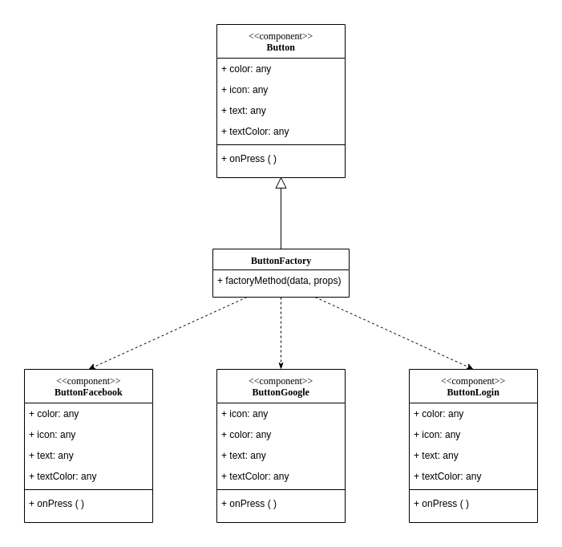

# GOFs

#### Histórico de revisões
|    Data    | Versão |                  Descrição                  |           Autor(es)            |
| :--------: | :----: | :-----------------------------------------: | :----------------------------: |
| 15/10/2019 |  0.1   | Iniciando o documento e adicionando padrões |          André Lucas           |
| 18/10/2019 |  0.2   |         Adicionando padrão Factory          | André Lucas e Victor Rodrigues |
| 24/10/2019 |  0.3   |         Adicionando informações no padrão factory          | Victor Rodrigues e André Lucas |
| 24/10/2019 |  0.4   |         Adicionando Padrão Observer          | Caio César Beleza |

## 1. GOFs Criacionais

### 1.1 Factory

É um padrão criacional que define uma interface ou classe abstrata para a criação de um objeto, mas deixe as subclasses decidirem qual classe instanciar. Em outras palavras, as subclasses são responsáveis ​​por criar a instância da classe.

### Factory no Cafofo

Implementamos o Factory Method para criar uma fábrica de botões. A estrutura do botão permanece a mesma, diferenciando apenas as cores, texto e ações de cada um.

Vamos criar um botão de forma abstrata, porque o mesmo será sobrescrito no final:

```javascript
const button = ({ onClick, icon, type, text, backColor }) => (
    <button style={content, { backgroundColor: backColor }} type={type} onClick={onClick}>
        {icon ?  : null}
        <text style={textStyle}>{text}</text>
    </button>
)

var Button = React.createFactory((button));

export default button;
```

Depois iremos criar a nossa fábrica de botões, instanciando cada tipo de botão:
```javascript
class ButtonFactory {
    static factoryMethod(data, props) {
        switch (data) {
            case 'facebook':
                return <Button
                    icon={fb}
                    text={"Entrar com Facebook"}
                    backColor={'#3b5998'}
                    type={"submit"}
                />
            case 'email':
                return <Button
                    icon={email}
                    text={"Entrar"}
                    backColor={'#fa6900'}
                    type={"submit"}
                />
            case 'google':
                return <Button
                    icon={google}
                    text={"Entrar com Google"}
                    backColor={'red'}
                    type={"submit"}

                />
        }
    }
}

export default (ButtonFactory);
```

Agora cada botão possui cores, ações e textos diferentes. Por fim o componente ficará estruturado assim:

```javascript
import ButtonFactory from '../../factory/button/index';

render() {
    return (
        <Container>
            <Form onSubmit={this.handleSubmit}>
                <h1>Acesse a sua conta</h1>
                <input
                    type="email"
                    placeholder="Endereço de e-mail"
                    onChange={e => this.setState({ email: e.target.value})}
                />
                <input
                    type="password"
                    placeholder="Senha"
                    onChange={e => this.setState({ password:e.target.value })}
                />
                <Link to="/esqueci-a-senha">Esqueceu sua senha?</Link>

                //Botão de login com email
                {ButtonFactory.factoryMethod('email')}

                //Botão de login com facebook
                {ButtonFactory.factoryMethod('facebook')}

                //Botão de login com google
                {ButtonFactory.factoryMethod('google')}

                <hr />
                <Link to="/cadastro">Cadastre-se</Link>
            </Form>
        </Container>
    );
}
```

Este é o diagrama que representa a fábrica de botões:




## 2. GOFs Estruturais

### 2.1 Decorator

O padrão Decorator é utilizado quando precisa-se anexar responsabilidades dinamicamente sem precisar de uma grande hierarquia de subclasses.
A descrição original do Padrão Decorator é: "O Padrão Decorator anexa responsabilidades adicionais a um objeto dinamicamente. Os decoradores fornecem uma alternativa flexível de subclasse para estender a funcionalidade".

O Padrão Decorator tem como característica o seguinte:

- Os decoradores têm o mesmo supertipo que os objetos que eles decoram;
- Você pode usar um ou mais decoradores para englobar um objeto;
- Uma vez que o decorador tem o mesmo supertipo que o objeto decorado, podemos passar um objeto decorado no lugar do objeto original (englobado);
- O decorador adiciona seu próprio comportamento antes e/ou depois de delegar o objeto que ele decora o resto do trabalho;
- Os objetos podem ser decorados a qualquer momento, então podemos decorar os objetos de maneira dinâmica no tempo de execução com quantos decoradores desejarmos.

### 2.2 Exemplo

## 3. GOFs Comportamentais
### 3.1 Observer

O padrão observer permite definir um mecanismo de aviso, que notifica múltiplos objetos sobre eventos que ocorrem com os objetos que eles estão observando.
Este padrão é utilizado quando o acoplamento das classes está crescendo, ou quando se tem ações a serem executadas apoós um determinado processo.

```
from rest_framework.permissions import IsAuthenticated ,AllowAny ,IsAdminUser
from rest_framework.response import Response
from rest_framework.views import APIView
from rest_framework.decorators import permission_classes
from rest_framework import viewsets, generics
from users.models import CustomUser
from users.serializers import UserSerializer,UserCreateUpdateSerializer


@permission_classes([IsAuthenticated])
class ExampleView(APIView):
    #permission_classes = [IsAuthenticated]

    def get(self, request, format=None):
        content = {
            'status': 'request was permitted'
        }
        return Response(content)


class UserUpdateDeleteSet(generics.RetrieveUpdateDestroyAPIView):
    queryset = CustomUser.objects.all()
    serializer_class = UserSerializer
    permission_classes = (AllowAny,)


class ListUser(generics.ListAPIView):
    #permission_classes = [IsAdminUser]
    queryset = CustomUser.objects.all()
    serializer_class = UserSerializer

class CreateUser(generics.CreateAPIView):
    permission_classes = [AllowAny]
    queryset = CustomUser.objects.all()
    serializer_class = UserCreateUpdateSerializer
```

Neste exemplo é mostrado "@permission_classes" que funciona para autenticar quem pode acessar as páginas, que no caso, seriam apenas usuários que possuem cadastro na aplicação.</p>
O observer pode ser utilizado neste caso por que a aplicação espera a notificação de que o usuário está logado, para "avisar" aos outros objetos que agora poderão ser acessados por este usuário.
