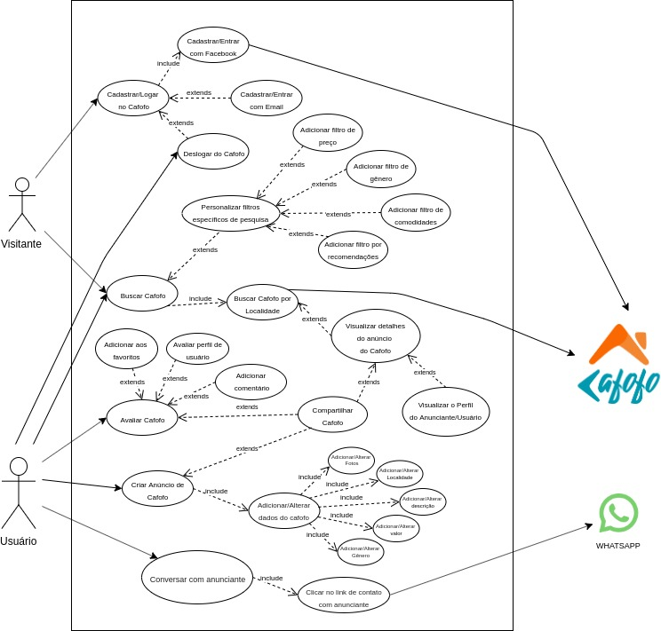
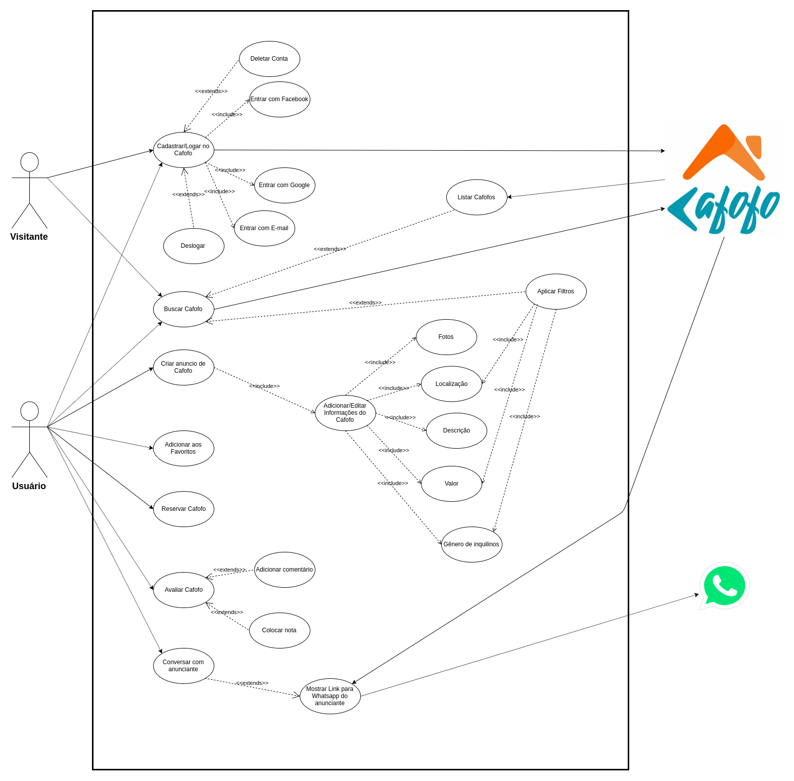
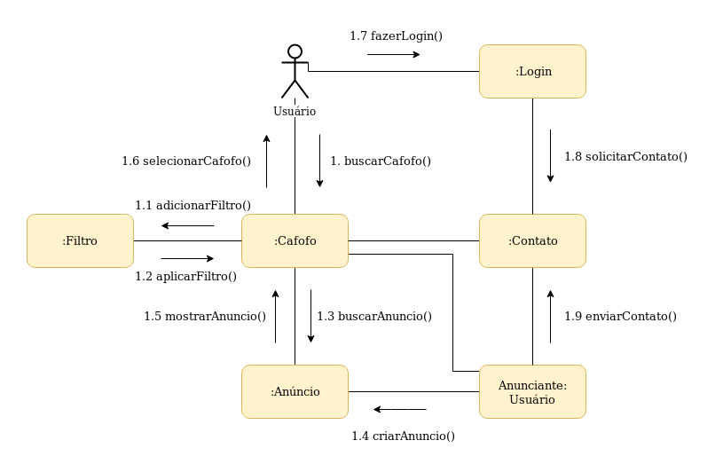
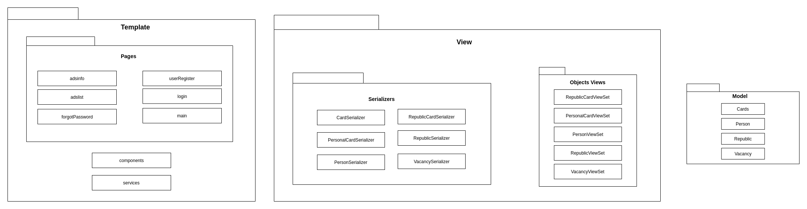
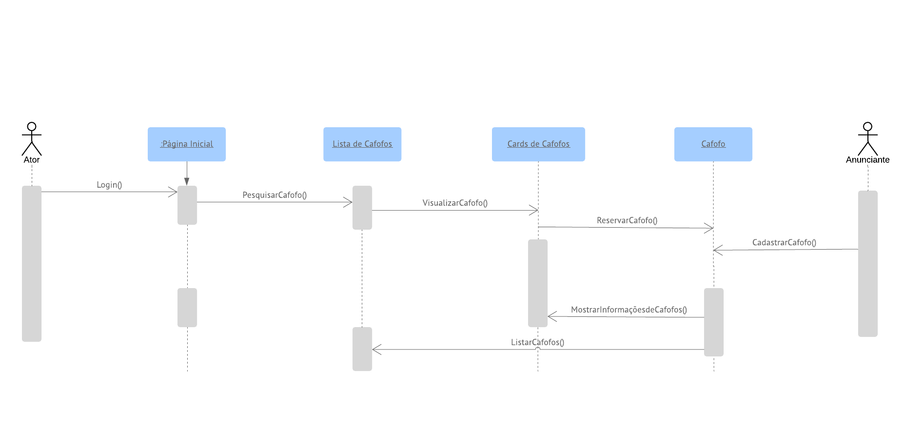
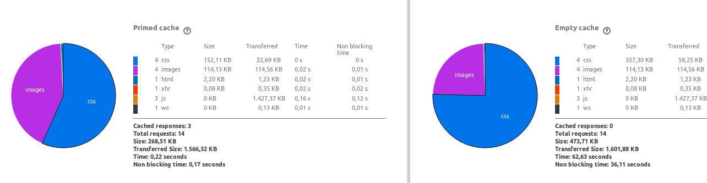

# Documento de Arquitetura de Software

#### Histórico de revisões
|    Data    | Versão |       Descrição       |    Autor(es)     |
| :--------: | :----: | :-------------------: | :--------------: |
| 04/11/2019 | 0.1 | Iniciando o documento e adicionando o Sumário | Weiller Fernandes |
| 04/11/2019 | 0.2 | Adicionando Objetivo e Escopo | Weiller Fernandes |
| 09/11/2019 | 0.3 | Adicionando Metas e Restrições | Caio César Beleza |
| 09/11/2019 | 0.4 | Adicionando Visão de Casos de Uso | Caio César Beleza |
| 09/11/2019 | 0.5 | Adicionando Visão Lógica geral | Caio César Beleza |
| 09/11/2019 | 0.6 | Adicionando Definições, Acrônimos e Abreviações e Visão Geral | João Gabriel |
| 12/11/2019 | 0.7 | Adicionando Diagrama de Pacotes | Caio César Beleza|
| 12/11/2019 | 0.8 | Adicionando Diagrama de Colaboração | Weiller Fernandes |
| 13/11/2019 | 0.9 | Iniciando Visão de Implementação | Caio César Beleza |
| 13/11/2019 | 1.0 | Correção do tópico Definições, Acrônimos e Abreviações | Weiller Fernandes |
| 13/11/2019 | 1.1 | Correção da descrição do Diagrama de Colaboração | Weiller Fernandes |
| 13/11/2019 | 1.2 | Adicionando tópico Qualidade | Weiller Fernandes |
| 13/11/2019 | 1.3 | Iniciando Visão de Implantação e adicionando diagrama | Caio César Beleza |
| 14/11/2019 | 1.4 | Adicionando Tamanho e Desempenho | Weiller Fernandes |
| 14/11/2019 | 1.5 | Adicionando diagrama de Realização dos Casos de Uso | Caio César Beleza |
| 14/11/2019 | 1.6 | Adicionando diagrama de Casos de Uso versão 2.0| Caio César Beleza |
| 18/11/2019 | 1.7 | Adicionando diagrama de Sequência| Caio César Beleza |

## Sumário
  - [1. Introdução](#1-introducao)
    - [1.1 Objetivo](#11-objetivo)
    - [1.2 Escopo](#12-escopo)
    - [1.3 Definições, Acrônimos e Abreviações](#13-definicoes-acronimos-e-abreviacoes)
    - [1.4 Referências](#14-referencias)
    - [1.5 Visão Geral](#15-visao-geral)
  - [2. Representação Arquitetural](#2-representacao-arquitetural)
  - [3. Restrições e Metas Arquiteturais](#3-restricoes-e-metas-arquiteturais)
  - [4. Visão de Casos de Uso](#4-visao-de-casos-de-uso)
  - [5. Visão Lógica](#5-visao-logica)
  - [6. Visão de Processo](#6-visao-de-processo)
  - [7. Visão de Implementação](#7-visao-de-implementacao)
  - [8. Visão de Implantação](#8-visao-de-implantacao)
  - [9. Tamanho e Desempenho](#10-tamanho-e-desempenho)
  - [10. Qualidade](#11-qualidade)

## 1. Introdução

### 1.1 Objetivo

Este documento apresenta a arquitetura proposta para o projeto Cafofo, realizado na disciplina de Desenho de Software no segundo semestre de 2019. Com o objetivo de capturar e formalizar as principais decisões tomadas com relação à arquitetura do sistema e fornecer uma visão arquitetural abrangente deste, fazendo uso de diversas visões para representar diferentes aspectos da aplicação.

### 1.2 Escopo

O projeto Cafofo tem como principal objetivo auxiliar alunos de uma Universidade, sejam eles calouros ou veteranos, a encontrarem um local para morar. É bastante comum as Universidades receberem alunos vindos de outros estados e países e muitas vezes esses tem dificuldade para encontrar uma moradia que seja próxima a faculdade, ou ambientes habitacionais universítarios. A proposta é que a plataforma seja capaz de centralizar oferta e demanda de apartamentos e quartos universitários. Portanto, as principais funcionalidades do Cafofo são:

- Buscar moradias que tenham o foco em receber estudantes universitários.
- Anunciar casas/repúblicas para aluguel.
- Editar ou excluir anúncios existentes.
- Filtrar os anúncios de acordo com suas preferências.
- Entrar em contato com o anunciante, através de link para o whatsapp, para concretizar o aluguel.

### 1.3 Definições, Acrônimos e Abreviações
* DAS: Documento de Arquitetura de Software
* DRF: Django Rest Framework
* API: Application Programming Interface (Interface de Programação de Aplicativos)
* REST: Representational State Transfer (Transferência de Estado Representacional)
* HTTP: Hypertext Transfer Protocol (Protocolo de Transferência de Hipertexto)
* App: Application (Aplicativo)
* MVC: Model-View-Controller
* MVT: Model-View-Template
* UC: Use Case (Caso de Uso)
* UML: Unified Modeling Language
* URL: Uniform Resource Locator (Localizador Uniforme de Recursos)
* SGBD: Sistema de Gestão de Base de Dados

### 1.4 Referências

- [DAS Template](http://sce.uhcl.edu/helm/RationalUnifiedProcess/webtmpl/templates/a_and_d/rup_sad.htm)
- [React](https://pt.wikipedia.org/wiki/React_(JavaScript))
- [DRF](https://www.django-rest-framework.org/)
- [Postgres](https://www.educacaoetecnologia.org/artigo/2011/06/09/quais-as-vantagens-de-utilizar-postgresql/)
- [Diagrama de Pacotes](https://micreiros.com/diagrama-de-pacotes/)
- [Psycopg](http://initd.org/psycopg/)
- [Análise de Performance](https://developer.mozilla.org/pt-BR/docs/Tools/Network_Monitor/Performance_analysis)
- [Diagrama de Sequência](https://www.ateomomento.com.br/diagrama-de-sequencia-uml/)

### 1.5 Visão Geral
Neste documentos iremos detalhar as soluções de arquiteturar aplicadas neste projeto. Seguindo os seguitnes tópicos:

* Representação Arquitetural
* Restrições e Metas Arquiteturais
* Visão de Casos de Uso
* Visão Lógica
* Visão de Processos
* Visualização da Implementação
* Visão de Dados
* Tamanho e Desempenho
* Qualidade

## 2. Representação Arquitetural

## 2.1. Visão Geral

A Figura acima ilustra de forma simples como os componentes do projeto estão organizados. Existem 3 partes principais distintas, são elas: O Back-end, Front-end e o Banco de Dados.

## 2.2. Front-end

Essa é a camada de interação do usuário. Através dela o usuário é capaz interagir com a aplicação. O acesso se dá pela utilização de um web browser, através de um endereço http específico. Conforme o escopo do projeto e decisão da equipe, essa é a única plataforma disponível ao usuário, não havendo um aplicativo para smartphones ou semelhante.

A nível técnico, sua principal funcionalidade é a comunicação com a API.

### 2.2.1 Tecnologias

"O React é uma biblioteca JavaScript de código aberto com foco em criar interfaces de usuário em páginas web. É mantido pelo Facebook, Instagram, outras empresas e uma comunidade de desenvolvedores individuais. É utilizado nos sites da Netflix, Imgur, Feedly, Airbnb, SeatGeek, HelloSign, Walmart e outros." [2]

A ferramenta foi escolhida devido a sua facilidade de implementação, visto o conhecimento da equipe, grande suporte da comunidade e documentação abrangente. A sua capacidade de reaproveitamento de código torna a ferramenta desejável no desenvolvimento de produtos de software.

## 2.3. Back-end

Essa é a camada de integração entre o Front-end e o Banco de Dados. A API é um conjunto de comandos, funções, protocolos e objetos usados para interagir com sistemas externos. Sua função é armazenar e disponibilizar os dados da aplicação para a visualização por parte do usuário.

### 2.3.1 Tecnologias

Representational State Transfer (REST) é um estilo de projeto de arquitetura de desenvolvimento web que se refere à separação lógica dos recursos da API, habilitando fácil acesso, manipulação e dimensionamento. Componentes reusáveis são escritos para serem facilmente adminitrados através de requisições HTTP simples e intuitivas, como GET, POST, PUT, PATCH e DELETE (pode ter mais, mas essas são as mais usadas).

"A estrutura REST do Django é um kit de ferramentas poderoso e flexível para criar APIs da Web."[5]

## DRF

Para desenvolver a API, utilizaremos REST com Python e Django Rest Framework. O Django Rest Framework é proveniente do Django que é um Python Web Framework de alto nível possibilitando um desenvolvimento mais rápido e limpo. Trabalhando de forma singular seguindo o modelo MVT(Model - Views - Template), onde considera-se que a própria plataforma exerce o papel de Controler.

Sendo assim utilizado o Django Rest Framework para facilmente integrar Rest API às funcinalidades do Django

## 2.4. Banco de Dados

O PostgreSQL é um sistema gerenciador de banco de dados objeto relacional (SGBD), desenvolvido como projeto de código aberto. As principais vantagens do PostgreSQL são:
  - Imunidade ao fato de não ter que pagar por uma licença, muito menos para várias.
  - Performance bastante admirável.
  - Multi-plataforma.
  - Altamente escalável.

O PostgreSQL foi escolhido por atender a necessidade da equipe e pela facilidade na sua implantação e utilização por parte da equipe de desenvolvimento. Além disso, é um banco de dados consolidado na comunidade e possui uma documentação e suporte vastos.

## 3. Restrições e Metas Arquiteturais

### 3.1 Restrições
As restrições para o projeto Cafofo são as seguintes: 
- Para utilizar a aplicação é preciso ter conexão com a internet;

- A aplicação será suportada apenas por Web browsers, tais como Google Chrome e Mozilla Firefox;

- Para a API, será utilizado o framework Django versão 2.1, baseado na linguagem de programação Python, que será utilizada na versão 3.6.

- Para o Front end, será utilizado React, na versão 16.10.1, que é uma biblioteca JavaScript;

- A versão do Docker utilizada é 18.09.7 e Docker-compose 1.21.2;

- A equipe possui 8 integrantes;

- Tempo limitado à aproximadamente 4 meses, que é o tempo de duração da disciplina.

### 3.2 Metas
- A aplicação deve ser desenvolvida de tal maneira que seja de fácil manutenibilidade;

- A aplicação deve estar pronta para ser apresentada ao final da disciplina;

## 4. Visão de Casos de Uso
### 4.1 Atores

|    Atores    |       Descrição       |
| :--------:   |:-------------------:  |
| Usuário   |  Quem irá utilizar a plataforma, pessoas que desejam encontrar e/ou anunciar vagas em Cafofos.                  |
| Visitante | Pessoas que não são cadastradas, só podem fazer a pesquisa de Cafofos|
| Cafofo       | Responsável por conectar os usuários às vagas ofertadas.                      |

### 4.2 Diagrama de Casos de uso
**Versão 1.0**

**Versão 2.0**

### 4.3 Descrição dos casos de Uso

| Caso de Uso | Descrição |
| :-------:   | :-------: |
| UC01 - Cadastro    | O usuário se cadastra na aplicação        |
| UC02 - Login| O usuário cadastrado faz login na aplicação|
| UC03 - Criar anuncio de Cafofo| O usuário anuncia uma vaga em algum Cafofo |
| UC04 - Buscar Cafofo | O usuário busca uma vaga em um Cafofo|
| UC05 - Conversar com anunciante| O usuário pode tirar dúvidas sobre o cafofo com o anunciante|
| UC06 - Reservar Cafofo| O usuário reserva a vaga em um Cafofo que gostou|
| UC07 - Avaliar Cafofo| O usuário faz uma avaliação sobre um cafofo onde tenha se hospedado|
| UC08 - Adicionar Cafofo aos favoritos| O usuário adiciona um cafofo que goste aos seus favoritos|

### 4.4 Realização dos Casos de Uso

É uma visão do funcionamento do sistema escolhendo alguns casos de uso e os cenários nos quais podem ser aplicados.

**Versão 1.0**

## 5. Visão Lógica
### 5.1 Visão geral

O framework Django utiliza a arquitetura MVT(Model, View, Template), que é uma variação de padrão MVC, onde a camada Controller é substituída pela camada View e é adicionada a camada de Template, que é a camada de apresentação que será visualizada pelo usuário.

- **Models** 
  As models são as classes que representam os dados, e são responsáveis pela manutenção desses dados. 

- **Views** 
  A view é responsável por formatar os dados das Models. Ela se comunica com o banco de dados e transfere os dados para o template, onde serão visualizados.
  

- **Templates**   
  Templates consistem na camada estática que o usuário irá interagir. 
  No caso deste projeto, esta camada será representada com a biblioteca de JavaScript, React.

- **Banco de Dados**   
  Além da arquitetura tradicional do django, o projeto Cafofo terá um banco de dados em PostgreSQL, para o armazenamento dos dados de usuários e dos anuncios de Cafofos.

#### 5.1.1 Diagrama de Colaboração

Com esse diagrama podemos ver as funcionalidades dos principais elementos do software, mostrando a Colaboração dinâmica entre os objetos com ênfase no contexto do sistema.

### 5.2 Pacotes Significativos para a Visão de Arquitetural
#### 5.2.1 Diagrama de Pacotes
  O diagrama de pacotes é um conceito definido pela UML como um mecanismo de agrupamento genérico, utilizado para dividir um software grande e complexo em partes menores, para que seja mais fácil o entendimento de quem irá contribuir com ele, além de tornar mais prática a manutenção do mesmo. Essas partes menores interagem entre si.

  **Versão 1.0**
  

  **Versão 2.0**
  

## 6. Visão de Processo
### 6.1 Diagrama de Sequência
  O diagrama de sequência tem como objetivo representar o comportamento de uma funcionalidade, retratando a interação entre os componentes que são utilizados no cenário em que essa funcionalidade é ativada.

  **Diagrama de sequência do fluxo principal da aplicação**
  

## 7. Visão de Implementação
### 7.1 Visão geral
  O padrão arquitetural utilizado no projeto Cafofo é o padrão MVT com Rest framework, que foi dividido em duas camadas.

  A API, feita em Django, e utilizando o Rest Framework, é composto em três camadas: Model, View e Serializer.

  O Front end, foi feito com o React e representa o Template do projeto, que é a camada com a qual o usuário interage.

#### 7.1.1 API
- **Model** 
  O Cafofo apresenta, na camada Model, os dados de usuários, anuncios e vagas que são persistidos.

- **View** 
  A view controla o fluxo de informações entre a model e o template da aplicação. É a camada que contém a lógica por trás das informações que serão extraídas e exibidas ao usuário.

- **Serializer** 
  Os serializers permitem a conversão de dados em dados nativos do python, o que facilita a renderização de arquivos. São utilizados no projeto para facilitar a comunicação da API com o Front end.

#### 7.1.2 Front-end
- **Elementos** 
  Os elementos do React são objetos simples que representam o tipo do componente e as props.

- **Components** 
  Os componentes podem ser classes ou funções mas todos eles "se renderizam" a um elemento.

- **Montagem** 
  “Montagem” é um processo recursivo que cria uma árvore DOM ou Nativa dado um elemento React de nível superior (e.g. <App />).

## 8. Visão de Implantação
O diagrama a seguir mostra como os nós físicos do sistema se comunicam. 
  **Versão 1.0**
  

### 8.1 Servidor PostgreSQL
  Onde está armazenado o banco de dados contendo as informações dos usuários e anuncios do projeto Cafofo.
### 8.2 Servidor da API
  A API faz o envio das informações, buscando e interpretanto os dados do banco e os mandando para o template, seguindo o padrão REST.
### 8.3 Psycopg
  Psycopg é um adaptador do PostgreSQL para a linguagem de programação Python. Ele implementa as especificações do "Python DB API 2.0".  
### 8.4 Navegador
  O Web browser(navegador) recebe o WebApp Cafofo, que é a camada de interação do usuário com o sistema.

## 9. Tamanho e Desempenho

No primeiro acesso do usuário ao aplicativo, na página principal, o tamanho de todos os recursos totalizam juntos cerca de 473,21KB com um tempo total de 62,63 segundos de carregamento, esses valores diminuem nos acessos subseqüentes, onde cerca de 64KB são armazenados no computador do usuário, melhorando assim o desempenho e diminuindo o tempo de carregamento do aplicativo. [7]

## 10. Qualidade

Os padrões arquiteturais utilizados no projeto Cafofo contribuem fortemente para a escalabilidade e para a manutenabilidade da aplicação, como o facade por exemplo, presente tanto no back end quanto no front end, que ao ser aplicado reduz a complexidade ao mesmo tempo em que produz uma interface simplificada e reduz o acoplamento entre as camadas do projeto.
