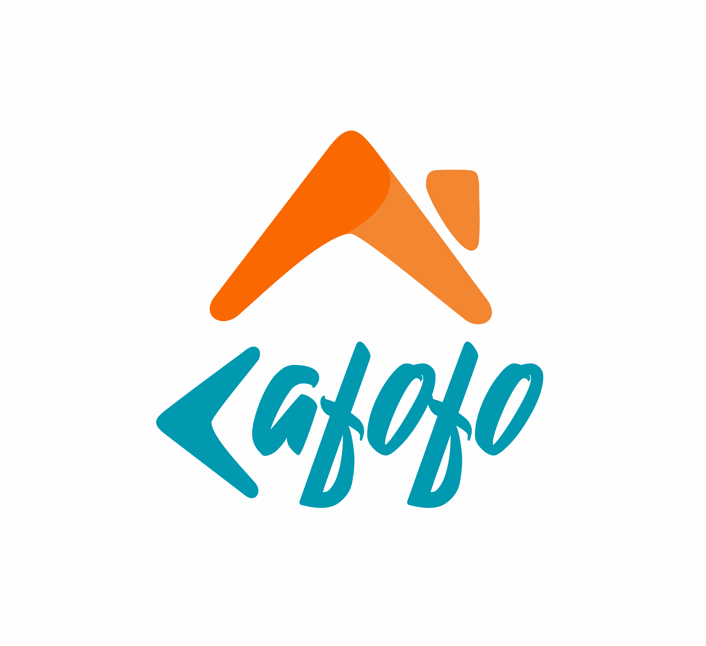
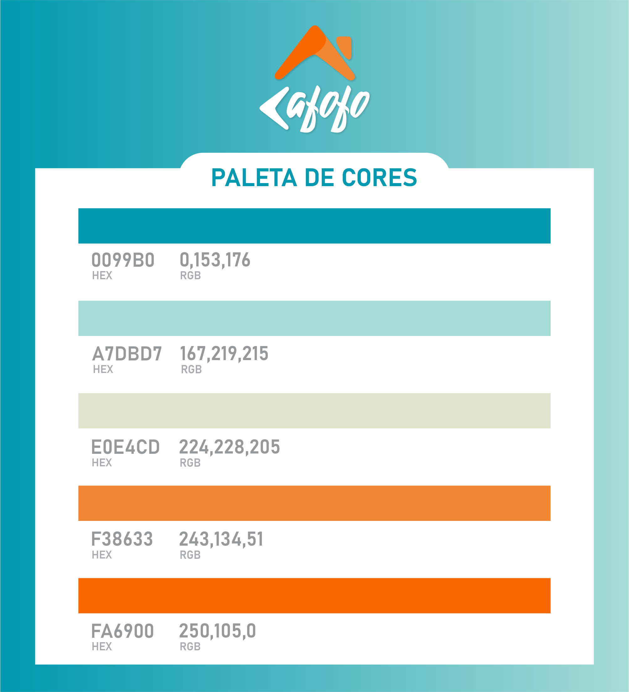

# Identidade Visual

#### Histórico de revisões
|   Data   |  Versão  |        Descrição       |          Autor(es)          |
|:--------:|:--------:|:----------------------:|:---------------------------:|
|01/09/2019|1.0| Iniciando o documento e adicionando Logo e Paleta de Cores |Lucas Gomes|

## 1. Logomarca

Logomarca é a forma com que o nome da marca é apresentado graficamente, seja usando apenas tipografia ou aliando tipografia e símbolo. Uma logomarca precisa ser forte, de modo que as pessoas acabem por reconhecer sua marca mesmo quando virem apenas o símbolo do logo, sem a tipografia.

Tendo em vista que a aplicação é um local para encontrar o local ideal para moradia, a logomarca do Cafofo foi pensada para ter uma simbologia bem forte, onde o símbolo principal representa um telhado com um chaminé, e ao mesmo tempo, possui o mesmo formato da letra "C" do logotipo da marca, possibilitando a utilização da marca de várias maneiras criativas e diferentes dentro da aplicação.

Autor: Lucas Gomes

## 2. Paleta de Cores

A cor é um dos elementos mais importantes na criação de uma marca. Compreender a importância e influência que a cor tem em seu projeto de marca é fundamental para produzir uma identidade forte e coerente.

A cor, inicialmente, não transmite sentido quando está sozinha, mas desempenha um papel importante na nossa percepção visual e, portanto, ter minimamente uma percepção das cores em design gráfico e web é crucial para criar uma paleta certa para o seu público-alvo. Ela exerce papel importantíssimo no psicológico humano. Sabe-se que temos reações e sentimentos diferentes para cada cor.

Apesar disso, muitos fatores externos também influenciam na percepção de cada indivíduo, como por exemplo: humor, cultura, ambiente, saturação de cor, iluminação, etc.

O público-alvo do Cafofo é a comunidade universitária, que deseja encontrar um local que possa se sentir confortável, um local para descansar, ter uma certa tranquilidade, e ao mesmo tempo recuperar as energias para enfrentar a rotina do universitário. 

Por conta disso, as cores principais escolhidas para representar a paleta de cores do Cafofo são o Azul e o Laranja. 

O Azul representa calma, confiança e segurança. De acordo com a tonalidade pode transmitir sensação de seriedade e confiança. Através de estudos, é considerada a cor preferida do mundo.

O Laranja é uma cor equilibrada, vibrante e cheia de energia. Também é amigável e convidativa. Reflete entusiasmo, sendo uma cor muito ativa, alegre e sociável. 

A variação entre essas cores permite a criação de uma paleta que ao mesmo tempo traz um sentimento de tranquilidade, e também um sentimento de energia e sociabilidade, para que a experiência do usuário seja a melhor possível alinhada com o propósito da aplicação.
